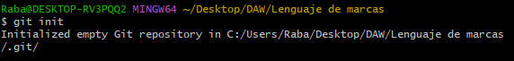
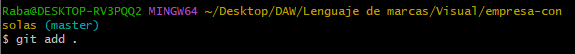
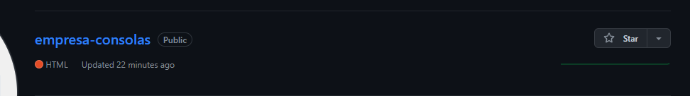
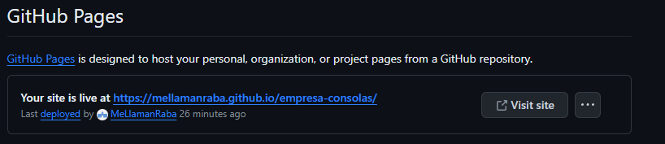
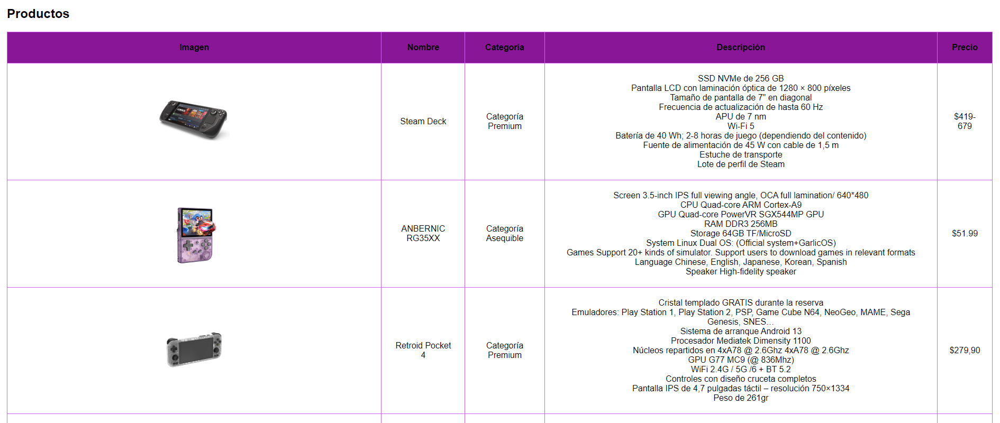
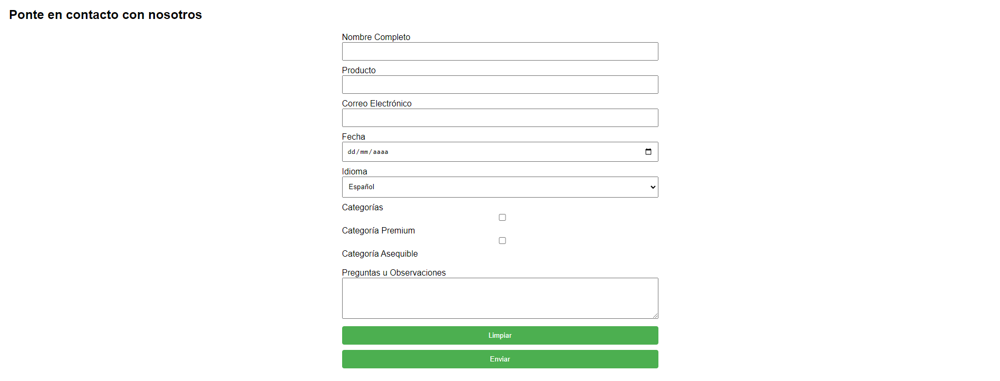

# Identificación

- **Nombre y Apellidos:** Antonio Rabaneda López
- **Nombre del Módulo:** Lenguaje de marcas
- **Instituto:** IES Aguadulce
- **Curso Escolar:** 2023/2024
- **Enlace a la Web:** [Console Zone](https://mellamanraba.github.io/empresa-consolas/)

## Uso de Git mediante la terminal git bash

* Creación del Repositorio en nuestro Ordenador:

    * Con este comando lo que harémos será crear una carpeta .git a modo de repositorio.

```bash
-- git init
```


* Creación de un commit inicial

    * Una vez creado el repositorio crearemos la primera versión con el siguiente comando.

```bash
-- git add
```


* Creación del repositorio en GitHub

    * Una vez hayamos hecho lo anterior, y hayamos enlazado el terminal y GitHub con los siguientes comandos tendriamos listo el repositorio.

```bash
-- git config --global user.email "rabaneda31524@gmail.com"
-- git config --global user.name "mellamanraba"
 ```


* Una vez que hayamos hecho esos pasos podremos Conseguir el enlace en Github Pages.

    * Iremos a la opcion de settings>Pages y en la parte de arriba tendremos nuestro enlace que nos llevara a nuestra pagina



* La pagina web una vez hecha quedaria tal que asi:




